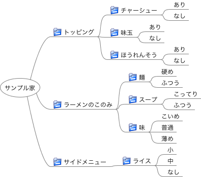

# 【FMPictの使い方】クラシフィケーションツリー法を実践する

## このドキュメントについて

このドキュメントでは、FMPictでクラシフィケーションツリー法を実践する方法について説明します。

[manual.md](manual.md) の補足ドキュメントです。

## クラシフィケーションツリー法の概要

クラシフィケーションツリー法は、組み合わせテストを設計するテスト設計技法です。以下のステップでテストケースを作ります。

1. テストの入力をクラシフィケーションツリーでモデリングする
1. クラシフィケーションツリーから、テスト網羅基準を満たすテストケースを作成する。

大まかな流れと記法を以下にまとめています。

https://www.slideshare.net/goyoki/ss-42412647

## FMPictでのクラシフィケーションツリー法の実践

### FMPictでクラシフィケーションツリーを描く

FMPictでは、FreeMindでクラシフィケーションツリーをモデリングします。クラシフィケーションのノードにはフォルダアイコンを付与するか、テキスト先頭に「@」を付与します。

前述の資料で作ったラーメンのクラシフィケーションツリーを以下に示します。



### FMPictでクラシフィケーションからテストケースを得る

2ワイズカバレッジ100%のテストケースを作成する場合は、以下のコマンドを実行します。

```
fmpict 作成したFreeMindファイルのファイルパス
```

その他のテスト網羅基準を用いる際は以下を参考にしてください。

* [様々な網羅基準でテストを生成](howto_select_coverage_criteria.md)
