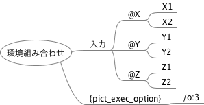
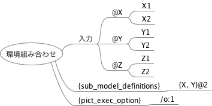

# 【FMPictの使い方】様々な網羅基準でテストを生成する

## このドキュメントについて

このドキュメントでは、FMPictでのテストの網羅基準の設定方法を記述します。

[manual.md](manual.md) の補足ドキュメントです。

## 2ワイズカバレッジ100%の組み合わせを生成する

FMPictはPICTで組み合わせを生成します。PICTと同じく、デフォルトでは2ワイズカバレッジ100%網羅のテストケースを生成します。

入力例：


出力結果：

```
Y       X       Z
Y2      X2      Z2
Y2      X1      Z1
Y1      X1      Z2
Y1      X2      Z1
```

## 1ワイズカバレッジ100%の組み合わせを生成する

1ワイズカバレッジ100%の組み合わせを生成する場合、「{pict_exec_option}」にそのPICTコマンド「/o:1」を記入します。

入力例：


出力結果：

```
Y       X       Z
Y2      X2      Z2
Y1      X1      Z1
```

## 3ワイズカバレッジ100%の組み合わせを生成する

3ワイズカバレッジ100%の組み合わせを生成する場合、「{pict_exec_option}」ノードにそのPICTコマンド「/o:3」を記入します。

入力例：



出力結果：

```
Y       X       Z
Y1      X2      Z1
Y2      X1      Z2
Y2      X2      Z2
Y2      X2      Z1
Y2      X1      Z1
Y1      X1      Z1
Y1      X1      Z2
Y1      X2      Z2
```

## 一つの値にバリエーションを持たせる

組み合わせテストでの値（水準orクラス）が、更に細かな値に分けられ、組み合わせでそれをまんべんなく網羅したい場合は、エイリアス機能を使います。
エイリアス機能を使う場合は、値を「|」で連結して記述します。

入力例(上記の例のうち、「X1」が「X1A」「X1B」に分けられるとする)：


出力結果：

```
Y       X       Z
Y2      X2      Z2
Y2      X1A     Z1
Y1      X1B     Z2
Y1      X2      Z1
```

## 組み合わせに制約を持たせる

組み合わせで制約をもたせたい場合、PICTの制約式を「{constraint_definitions}」ノードに記述します。

例えば、前述の例で「YがY1のときは、必ずXはX2を選ぶ」という制約を指定する場合を考えます。この場合、「IF [Y] = "Y1" THEN [X] = "X2";」の式を記述します。

入力例：


出力結果：

```
Y       X       Z
Y2      X1A     Z2
Y2      X2      Z1
Y1      X1B     Z1
Y2      X2      Z2
Y1      X1A     Z2
```

## 複数の網羅基準を組み合わせる

テスト条件によって複数のテスト網羅基準を切り替えたい場合、「{sub_model_definitions}」ノードで実現できる場合があります。

例えば1ワイズカバレッジ100%網羅を基本とするが、XとYの間だけは2ワイズカバレッジ100%網羅も行う場合について説明します。この場合、「{pict_exec_option}」ノードに「/o:1」を記入します。また「{sub_model_definitions}」に「{X, Y}@2」を記入します。

入力例：



出力結果：

```
Y       X       Z
Y2      X2      Z1
Y1      X2      Z2
Y2      X1      Z1
Y1      X1      Z1
```

## 異常系を考慮した組み合わせを生成する

組み合わせが評価されなくなる異常値（実行できない禁則組み合わせや、例外発生で処理が無効化される場合など）を、組み合わせテストでまとめて扱いたい場合があります。その場合PICTのNegative Testing記法が使えます。

例えば2ワイズカバレッジ100%網羅を行うものの、XがXInvのときの組み合わせはカバレッジ評価に用いない場合について説明します（例えば、XがXInvの場合、例外が発生してYとZの組み合わせ処理が未実行になるなど）。
この場合は、「XInv」先頭に「~」を付与すると実現可能です。

入力例：


出力結果(XInv以外の2ワイズカバレッジ100%網羅のテストケースと、XInvの時の追加テストケースを出力)：

```
Y       X       Z
Y1      X1      Z2
Y1      X1      Z1
Y2      X1      Z2
Y2      X1      Z1
Y2      ~XInv   Z2
Y1      ~XInv   Z1
```


