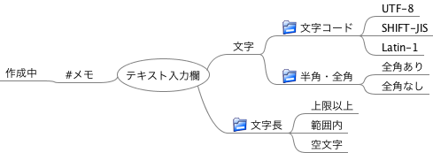
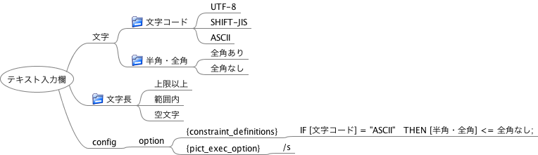

# FMPict ユーザマニュアル

## このドキュメントについて

このドキュメントではテストツールFMPictの概要、使い方、オプション定義を解説します。

## FMPict とは

FMPictは、FreeMindを使ってPICTを操作するテストツールです。

入力条件を描いたFreeMindファイルから、nワイズカバレッジ(n:1～3)を100%網羅するテストケースを生成します。

FMPictを利用するメリットは以下になります。

* 組合わせテストを、FreeMindのマインドマップでモデリングできます。それにより、組み合わせテスト・同値分割の抽象構造やグルーピング構造をわかりやすく表現できます。
* 重複するテスト条件を、一つにまとめて記述できます。
* FreeMindファイルの内容のみで、PICTの機能を活用できます（制約やサブモデルの定義、実行オプション指定含む）。
* クラシフィケーションツリー法ツールとして使用できます。

## 関連文書

クイックスタートやハウツーは以下で記述しています。このドキュメントは主に記法定義を解説します。

* [セットアップ](howto_setup.md)
* [クイックスタート](howto_quick_start.md)
* [様々な網羅基準でテストを生成](howto_select_coverage_criteria.md)

## 実行環境

実行には以下が必要です。

* Python3 or Python2.7
* PICT (https://github.com/Microsoft/pict/)
    * PICTの実行ファイルを参照可能にしてください
        * Windowsなら、PICT実行ファイル格納フォルダを、環境変数PATHに追加
* 動作確認環境：Windows 10, Mac OS X

「pip install fmpict」でインストールします。
FMpictの実行は、以下のようにコマンド実行します。

`fmpict FreeMindファイル`

詳細な環境構築のやり方は以下を参照ください。

[セットアップ](howto_setup.md)


## FreeMindの記法

ここではFreeMindの描き方ルールを説明します。

### 解説中の用語定義

* テスト条件ノード
    * テストの入力のノードです。直交表での因子、クラシフィケーションツリー法でのクラシフィケーションに該当します。
* 値ノード
    * テスト条件ノードがとり得る値のノードです。直交表での水準、クラシフィケーションツリー法でのクラスに該当します。

### コメント、無効ノードの書き方

* 「#」から始まるノードはコメントノードです。コメントノードとその子孫ノードは無視されます。  
* テキストが空のノードは無視されます。

以下の例ですと「#メモ」とその子孫ノードは無視されます。



### テスト条件ノード、値ノードの書き方

* フォルダアイコンが付与されたノード、あるいは「@」から始まるノードはテスト条件ノードです。　　
    * テスト条件ノードがテスト条件に、テスト条件ノードの子ノードが値になります。
    * フォルダアイコンと他の記法が重複していた場合、フォルダアイコンが無視されます。

以下の例ですと、「文字コード」「半角・全角」「文字長」がテスト条件としてピックアップされます。


上記の図でFMPictを実行した場合、以下のテキストデータが生成され、PICTに入力されます。

```
文字長:上限以上,範囲内,空文字
半角・全角:全角あり,全角なし
文字コード:UTF-8,SHIFT-JIS,Latin-1
```

### 階層分けされたテスト条件ノード、値ノードの書き方

テスト条件ノード、値ノードは階層化が可能です。

* 値ノードが階層化されている場合、末端のノードが処理に用いられます。
* テスト条件ノードが階層化されている場合、子孫にテスト条件ノードを持たないノードが処理に用いられます。

【値ノードの階層化の例】以下を入力すると「子ノード1」が無視されます。末端の「孫ノード1」「孫ノード2」「子ノード2」が処理に用いられます。


【テスト条件ノードの階層化の例】以下を入力すると、「テスト条件」が無視されます。子孫のテスト条件ノードを持たない「テスト条件1」「テスト条件A」が処理に用いられます。


### リンク記法

リンク記法は、重複するテスト条件を、一つにまとめて記述するために使用します。

* 「>」から始まるノードは、共通定義ノードです。  
* 「<」から始まるノードは、共通定義ノードへの参照です。  
* 「>」「<」以降のノードテキストが一致した場合、「共通定義ノードへの参照」は、「共通定義ノード」の子ノードに一括置換されます。

以下の例ですと、「<量の条件」ノードは、すべて「>量の条件」の子ノードに置換されます。


上記の図でFMPictを実行した場合、以下のテキストデータが生成され、PICTに入力されます。

```
麺の量:大,普通,小
具の量:大,普通,小,なし
```

### タグ記法

タグ記法は、解析するノードを絞り込むために使用します。

* 「[」「]」でかこった文字列がタグです。タグはノード文字列先頭に記述します。タグは半角英数字、アンダーバーのみ記述してください
    * タグは全てのノード（テスト条件ノード、値ノード、リンク、オプション含む）に付与できます。タグは常に先頭に記述ください。例えばテスト条件ノードにタグを付与する場合「[タグ]@テスト条件名」と記述ください。
    * タグは出力から削除されます。
    * 「[タグ1][タグ2]」のように複数のタグを列記できます。
* 後述するオプション引数で、タグ記法を有効化します。
    * オプション引数でタグオプション(-t)が指定された場合、引数で指定されたタグを持つノードを処理します。引数で指定されなかったタグを持つノードは、無視されます。

以下のFreeMindファイルを処理した場合について説明します。


【タグ記法を有効化しない場合】この例を以下のコマンドで実行した場合、「テスト入力1」「値1」「値2」がPICTに入力されます。

```
fmpict 例ファイル
```

【tag1のみ選択する場合】以下のコマンドで実行した場合、「テスト入力1」「値1」がPICTに入力されます。「値2」は無視されます。

```
fmpict 例ファイル -t "[tag1]"
```

【tag2、tag1を選択する場合】以下のコマンドで実行した場合、「テスト入力1」「値1」「値2」がPICTに入力されます。

```
fmpict 例ファイル -t "[tag1][tag2]"
```

### オプション記法

* {sub_model_definitions}が書かれたノードの子ノードは、PICT入力ファイルのsub_model_definitions部分に転記されます。  
* {constraint_definitions}が書かれたノードの子ノードは、PICT入力ファイルのconstraint_definitions部分に転記されます。
* {pict_exec_option}が書かれたノードの子ノードは、PICT実行時オプションに展開されます。

以下のFreeMindファイルで実行した場合について説明します。



上記の図でFMPictを実行した場合、以下のPICT入力データが生成されます（{constraint_definitions}の内容が末尾に追記される）。

```
文字コード:UTF-8,SHIFT-JIS,ASCII
半角・全角:全角あり,全角なし
文字長:上限以上,範囲内,空文字
IF [文字コード] = "ASCII"   THEN [半角・全角] <= 全角なし;
```

そして以下のPICT実行コマンドが実行されます({pict_exec_option}指定テキストを実行コマンド末尾に付記)。

```
pict PICT入力データファイル /c
```

## FMPictの実行オプション

fmpictは実行オプションを持ちます。

### オプション引数

* -h
    * ヘルプを表示します。
* -p FILE_PATH
    * 指定されたFILE_PATHにPICT入力ファイルを保存します（このオプションがない場合、FILE_PATHはtemp.txtになります）。
* -g
    * PICT実行をスキップします。PICT入力ファイル生成のみ行います。
* -s
    * 中間生成するPICT入力ファイルを削除せず保持します（このオプションがない場合、PICT入力ファイルは自動削除されます）。
* -t
    * タグ絞り込みを行います。"[tag名]"を列記した文字列を指定します。指定された文字列以外のタグノードは解析から除外されます。

実行例：sample.mmを入力に、pict_list.txtにPICT入力ファイルを保存

```
fmpict sample.mm -s -g -p pict_list.txt
```

### ヘルプ一覧
```
This tool generates test cases using freemind and pict

positional arguments:
  freemind_file_path    *.mm input file

optional arguments:
  -h, --help            show this help message and exit
  -p PICT_FILE_PATH, --pict_file_path PICT_FILE_PATH
                        save pict file to specified path
  -g, --genparamlist    execute until pict file generation
  -s, --savepictfile    save pict file
  -t SELECT_TAG_LIST, --select_tag_list SELECT_TAG_LIST
                        select specified tag in generating
```

## ライセンスや制限事項

FMPictはMITライセンスに基づいています。用途に制限はありません。

## フィードバック先

改善や不具合報告などのフィードバックがありましたら、以下までお知らせください。

Github: https://github.com/hiro-iseri/fmpict  
Mail: iseri.hiroki[a]gmail.com
