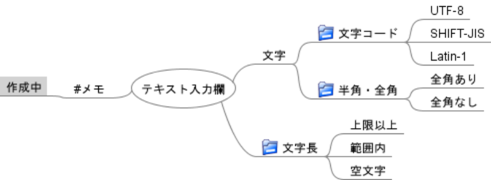
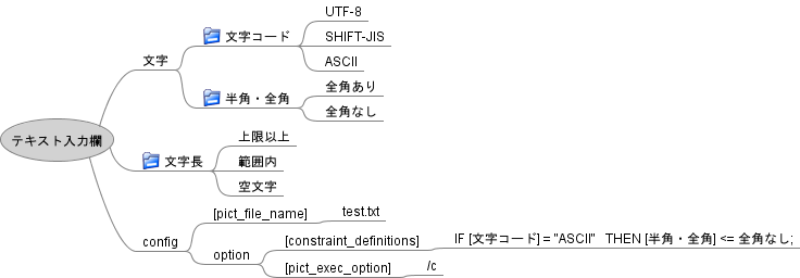

# FMPict ユーザマニュアル

## このドキュメントについて

このドキュメントではテストツールFMPictの概要、使い方、オプション定義を解説します。

## FMPict とは

FMPictは、FreeMindを使ってPICTを操作するテストツールです。

入力条件を描いたFreeMindファイルから、nスイッチカバレンジ(n:1～3)を100%網羅するテストケースを生成します。

FMPictを利用するメリットは以下の通りです。

* ツリー構造で組合わせテストのテスト条件をモデリングできます。それにより、例えば同値分割の抽象構造やグルーピング構造を表現できます。クラシフィケーションツリー法をサポートしています。
* 重複するテスト条件を、一つにまとめて記述できます。
* Freemindファイルの内容のみで、PICTの機能を活用できます（制約やサブモデルの定義、実行オプション指定含む）。

## 実行環境

実行には以下が必要です。

* Python3
* PICT (https://github.com/Microsoft/pict/)
    * PICTの実行ファイルを参照可能にしてください
        * Windowsなら、PICT実行ファイル格納フォルダを、環境変数PATHに追加

動作確認環境：Windows 10

## ツール導入（TBD）

fmpictフォルダに格納されたfmpict.pyを、適宜の場所に格納し使用します。1ファイルで完結しているため、その他インストール作業は不要です。
実行は、例えば以下コマンドを実行して使用します

`python fmpict.py FreeMindファイル`

## クイックスタート

1. Freemindで以下のように記述。「simple.mm」の名前で保存


2. fmpict.py(fmpictフォルダに格納)とsimple.mmを、同じフォルダに格納

3. CUI環境(Windowsならコマンドプロンプト)で以下を実行

`python fmpict.py simple.mm >output.txt`

4. 以下のテスト条件一覧がoutput.txtに保存される

```
煙草    性別
喫煙    女
喫煙    男
禁煙    男
禁煙    女
```

## 使い方解説

### FreeMindの記法

ここではFreeMindの描き方ルールを説明します。

#### 基本記法

「#」から始まるノードはコメントノードです。コメントノードとその子孫ノードは無視されます。  
テキストが空のノードは無視されます。  
フォルダアイコンが付与されたノード、あるいは「@」から始まるノードはテスト条件ノードです。テスト条件ノードがテスト条件（因子）に、テスト条件ノードの直接の子ノードが値（水準）になります。

以下の例ですと、「文字コード」「半角・全角」「文字長」がテスト条件としてピックアップされます。「#メモ」とそれに属するノードは無視されます。



上記の図でFMPictを実行した場合、以下のテキストデータが生成され、PICTに入力されます。

```
文字長:上限以上,範囲内,空文字
半角・全角:全角あり,全角なし
文字コード:UTF-8,SHIFT-JIS,Latin-1
```

### リンク記法

リンク記法は、重複するテスト条件を、一つにまとめて記述するために使用します。

「>」から始まるノードは、共通定義ノードです。  
「<」から始まるノードは、共通定義ノードへの参照です。  
「>」「<」以降のノードテキストが一致した場合、「共通定義ノードへの参照」は、共通定義ノードの子ノードに一括置換されます。

以下の例ですと、「<量の条件」ノードは、すべて「>量の条件」の子ノードに置換されます。


上記の図でFMPictを実行した場合、以下のテキストデータが生成され、PICTに入力されます。

```
麺の量:大,普通,小
具の量:大,普通,小,なし
```

### オプション記法

[sub_model_definitions]が書かれたノードの子ノードは、PICT入力ファイルのsub_model_definitions部分に転記されます。  
[constraint_definitions]が書かれたノードの子ノードは、PICT入力ファイルのconstraint_definitions部分に転記されます。

[pict_exec_option]が書かれたノードの子ノードは、PICT実行時オプションに展開されます。

以下のFreeMindファイルで実行した場合について説明します。



上記の図でFMPictを実行した場合、以下のPICT入力データが生成されます（[constraint_definitions]の内容が末尾に追記される）。

```
文字コード:UTF-8,SHIFT-JIS,ASCII
半角・全角:全角あり,全角なし
文字長:上限以上,範囲内,空文字
IF [文字コード] = "ASCII"   THEN [半角・全角] <= 全角なし;
```

そして以下のPICT実行コマンドが実行されます([pict_exec_option]指定テキストを実行コマンド末尾に付記)。

```
pict PICT入力データファイル /c
```

### FMPictの実行オプション

fmpict.pyは実行時コマンドをいくつか受け取ります。

#### オプション引数

* -h
    * ヘルプを表示します。
* -p FILE_PATH
    * 指定されたFILE_PATHにPICT入力ファイルを保存します（このオプションがない場合、FILE_PATHはtemp.txtになります）。
* -g
    * PICT実行をスキップします。PICT入力ファイル生成のみ行います。
* -s
    * PICT入力ファイルを削除せず保持します（このオプションがない場合、PICT入力ファイルは自動削除されます）。

実行例：sample.mmを入力に、pict_list.txtにPICT入力ファイルを保存

```
python fmpict.py sample.mm -s -g -p pict_list.txt
```

#### ヘルプ一覧
```
This tool generates test cases using freemind and pict

positional arguments:
  freemind_file_path    *.mm input file

optional arguments:
  -h, --help            show this help message and exit
  -p PICT_FILE_PATH, --pict_file_path PICT_FILE_PATH
                        save pict file to specified path
  -g, --genparamlist    execute until pict file generation
  -s, --savepictfile    save pict file
```

## ライセンスや制限事項

FMPictのコードはMITライセンスに基づいています。  
用途に制限はありません。開発者は、本ツールで発生した損害や問題の責任を負いません。ユーザの自己責任に基づいて使用ください。

## フィードバック先

改善や不具合報告などのフィードバックがありましたら、以下までお知らせください。

Github: https://github.com/hiro-iseri/fmpict  
Mail: iseri.hiroki[a]gmail.com