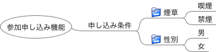

# FMPict ユーザマニュアル

## このドキュメントについて

このドキュメントではテストツールFMPictの概要、使い方、オプション定義を解説します

## FMPict とは

FMPictは、FreeMindを使ってPICTを操作するテストツールです。

入力条件を描いたFreeMindファイルから、nスイッチカバレンジ(n:1～3)を100%網羅するテストケースを生成します。条件組合わせには禁足を設定可能です。

FMPictを利用するメリットは以下の通りです。

* ツリー構造で組合わせテストのテスト条件をモデリングできます。それにより、例えば同値分割の抽象構造やグルーピング構造を表現できます。クラシフィケーションツリー法をサポートしています。
* 重複するテスト条件を、一つにまとめて記述できます。
* Freemindファイルの内容のみで、PICTの機能を活用できます（禁足やサブモデル、実行オプション含む）。

## 実行環境

実行には以下が必要です。

* Python3
* PICT (https://github.com/Microsoft/pict/)
    * PICTの実行ファイルへ参照可能にしてください
        * Windowsなら、PICT実行ファイル格納フォルダを、環境変数PATHに追加

動作確認はWindows 10で実施

## クイックスタート

1. Freemindで以下のように記述。「simple.mm」の名前で保存


2. fmpict.py(fmpictに格納)と、simple.mmを同じフォルダに格納

3. CUI環境(Windowsならコマンドプロンプト)以下を実行

`python fmpict.py simple.mm`

4. 以下のテスト条件一覧が出力される

```
煙草    性別
喫煙    女
喫煙    男
禁煙    男
禁煙    女
```

## 使い方解説

### FreeMindの記法

#### 基本記法

「#」から始まるノードはコメントノードです。コメントノードとその子孫ノードは無視されます。  
Freemindのフォルダアイコンが付与されたノード、あるいは「@」から始まるノードはテスト条件ノードです。テスト条件ノードがテスト条件（因子）に、テスト条件ノードの直接の子ノードが値（水準）になります。

以下の例ですと、「文字コード」「半角・全角」「文字長」がテスト条件としてピックアップされます。「#メモ」とそれに属するノードは無視されます。


上記の図でFMPictを実行した場合、以下のようなファイルが生成され、PICTに入力されます。

```
文字長:上限以上,範囲内,空文字
半角・全角:全角あり,全角なし
文字コード:UTF-8,SHIFT-JIS,Latin-1
```

### リンク記法

「>」から始まるノードは、共通定義ノードです。
「<」から始まるノードは、共通定義ノードへの参照です。
「>」「<」以外のノードテキストが一致した場合、「共通定義ノードへの参照」は、共通定義ノードの子ノードに一括置換されます。

### オプション記法

[sub_model_definitions]が書かれたノードの子ノードは、PICTへの入力のsub_model_definitions部分に転記されます。  
[constraint_definitions]が書かれたノードの子ノードは、PICTへの入力のconstraint_definitions部分に転記されます。

[pict_exec_option]が書かれたノードの子ノードは、PICT実行時オプションに展開されます。

[pict_file_name]が書かれたノードの子ノードは、PICT入力ファイルパスになります。  
FMPictは、PICTへの入力を一時的にファイル化しています。PICT入力ファイルパスは、その入力ファイルの保存先になります。  
[pict_file_name]未指定の場合、PICT入力ファイルパスは「./temp.txt」になります。

## ライセンスや制限事項

FMPictのコードはMITライセンスに基づいています。  
用途に制限はありません。  
開発者は、本ツールで発生した損害や問題の責任を負いません。ユーザの自己責任に基づいて使用ください。

## フィードバック先

改善や不具合報告などのフィードバックがありましたら、以下までお知らせください。

Github: https://github.com/hiro-iseri/fmpict  
Mail: iseri.hiroki[a]gmail.com