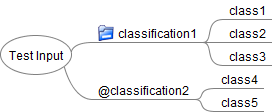
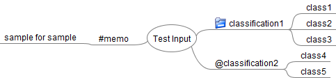
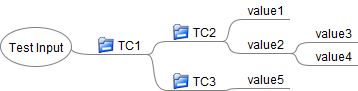
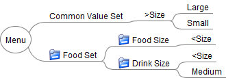
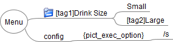
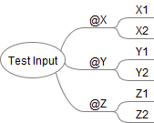
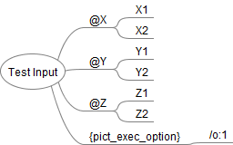

# FMPict User’s Guide

## Overview

FMPict helps test design using classification tree method.
FMPict generates test case covering n-wise coverage(n:1-3) from a freemind file descripted classification tree.

## Install

The following tools must be installed:

* PICT
    * FMPict must be able to refer PICT Application. For Windows, the folder path including pict.exe must be added to the system environment variable "PATH".
* FreeMind
* Python

FMPict is the command line interface tool.

### Install Command

```
pip install fmpict
```

### Uninstall Command

```
pip uninstall fmpict
```

### Execution environment

Windows, MaxOS X

## Run FMPict

When the following command is executed, FMPict generates a testcase by FreeMind file and output it to standard output.

`fmpict [filepath of FreeMind file]`

When the following command is executed, FMPict generates test condition and saves as "testcondition.txt".

`fmpict [filepath of FreeMind file] -s -g -p testcondition.txt`

## Style of FreeMind

### Basic Node Type

FMPict uses two basic nodes to describe test conditions.

* Test Condition Node
    * Test Input. This node corresponds to classification in the classification tree method.
    * Node with folder icon, or Nodes that start with the '@' character are test condition node.
* Value Node
    * Value of Test Condition Node. This node corresponds to class in the classification tree method.
    * A child of the test condition node that don't have a suffix or folder icon is the value node
 
Example:



When FMPict retrieves the above figure, FMPict generates the following text file and input it to PICT.

```
classification1:class1, class2, class3
classification2:class4, class5
```

### Comment and invalid node

The Nodes starting with "#" are comment nodes.
Comment nodes and their descendants are ignored.

Example:



When FMPict retrieves the above figure, FMPict ignores "#memo" and "sample for sample"

### Hierarchy of test conditions and values

Test conditions and values ​​can have a hierarchical structure.

* If the value node is hierarchical, FMPict only use leaf node.
* If test condition node is hierarchical, FMPict only use test conditions node that all descendants are value node.

Example:




If FMPict retrieves the above Freemind file, FMPict uses TC2, TC3, value1, value3, value4. And FMPict ignores TC1 and value2.


### Link Prefix

Link notation is used to　eliminate duplication of nodes.

* Nodes starting with ">" are common definition nodes.
* Nodes starting with "<" are references to common definition nodes.
* If the node texts after ">" or "<" match, the reference to common definition nodes are replaced with the child node of common definition node.

In the following example, all "<Size" nodes will be replaced by child nodes of ">Size".



When FMPict is executed in the above figure, FMPict generates the following text data and input it to PICT.

```
Food Size:Large,Small
Drink Size:Large,Small,Medium
```

### Tag Selection

The Tag notation is used to select node.

* A keyword surrounded by “[” and “]” is a tag.
    * A tag keyword allows only half-width alphanumeric characters and underscores.
    * Tags can be attached to all nodes.
    * A tag must be inserted at the beginning of the node string. For example, when adding a tag to a test condition node, tag must be described as "[tag]@test_condition_name".
    * A tag is removed from the output.
    * Multiple tags can be listed like "[Tag 1] [Tag 2]".
* When -t option is specified, only the node with the specified tag is used.

Example:


[Tag is not enabled] When this example is executed with the following command, “Small”, “Large” are input to PICT.

```
fmpict [targetfile]
```

[Tag1 is selected] When this example is executed with the following command, "Small" is input to PICT. "Large" is ignored.

### Option Node

* Child nodes of nodes writing {sub_model_definitions} are transferred to the sub_model_definitions part of the PICT input file.
* Child nodes of nodes writing {constraint_definitions} are transferred to the constraint_definitions part of the PICT input file.
* Child nodes of nodes writing {pict_exec_option} are transferred to PICT execution options.

Example:



When FMPict retrieves the above figure, FMPict executes pict with following command.

```
pict [freemind file] /s
```

## Selecting Test Coverage Criteria

FMPict select test coverage by specifying options to {pict_exec_option}

### Select 2-wise coverage 100%

If no options are specified, FMPict generates a test case covering 2wise coverage 100%.

Input File:



Output:

```
Y       X       Z
Y2      X2      Z2
Y2      X1      Z1
Y1      X1      Z2
Y1      X2      Z1
```

### Select 1-wise coverage 100%

if “/o:1” option is specified in the child node of {pict_exec_option}, FMPict generates a test case covering 1wise coverage 100%.

Input File:



Output:

```
Y       X       Z
Y2      X2      Z2
Y1      X1      Z1
```

if “/o:3” option is specified in the child node of {pict_exec_option}, FMPict generates a test case covering 3wise coverage 100%.

## Detailed Option

* -h
    * Display help.
* -p FILE_PATH
    * Save the PICT input file to the specified FILE_PATH (default FILE_PATH string is "temp.txt").
* -g
    * Skip PICT execution.
* -s
    * Keep the PICT input file(the PICT input file is automatically deleted if this option is not specified).
* -t
    * Filters tags. Specify a keyword that lists "[tag name]".

Execution example: input sample.mm and save PICT input file to pict_list.txt

```
fmpict sample.mm -s -g -p pict_list.txt
```

## Contact

Github: https://github.com/hiro-iseri/fmpict  
Mail: iseri.hiroki[＠]gmail.com
Author: Hiroki Iseri
