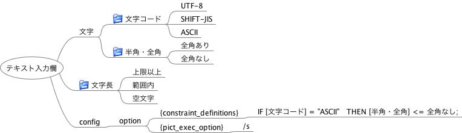

# FMPict User’s Guide

## Overview

FMPict help test design by classification tree method.
FMPict retrieves a freemind file descripted classification tree, and generates test case covering n-wise coverage(n:1-3).

The advantages of PMPict:

* FMPict can express a combination test in freeminde. So FMPict can clearly express equivalence partitions and abstract structure of test conditions.
* FMPict can erase repeated descriptions of test conditions.

## Install

the following tools should be installed:

* PICT
* FreeMind
* Python

### Install Command

```
pip install fmpict
```

### Uninstall Command

```
pip uninstall fmpict
```

### Execution check environment

Windows 10, MaxOS X

## Run fmpict

if you run the following command, fmpict generates a testcase by freemind file and output it to standard output.

`fmpict [filepath of FreeMind file]`

if you run the following comannd, fmpict generates testcase file.

`fmpict [filepath of FreeMind file] -s -g`

## Style of FreeMind

### Basic Node Type

* Test Condition Node
    * Test Input. This node corresponds to classification in the classification tree method.
    * Node with folder icon, or Nodes that start with the @ character are test condition node.
* Value Node
    * Value in Test Condition Node. This node corresponds to class in the classification tree method.
    * a child of the test condition node, and the inner node in the test condition node is the value node

Example:


when fmpict retrieves the above figure, fmpit generates the following text file and input it to PICT.

```
classification1:class1, class2, class3
classification2:class4, class5
```

### Comment and invalid node

* Nodes starting with "#" are comment nodes. Comment nodes and their descendants are ignored.


以下の例ですと「#メモ」とその子孫ノードは無視されます。

Example:


when fmpict retrieves the above figure, fmpit ignores "#memo" and "sample for sample"

### 階層分けされたテスト条件ノード、値ノードの書き方

テスト条件ノード、値ノードは階層化が可能です。

* 値ノードが階層化されている場合、末端のノードが処理に用いられます。
* テスト条件ノードが階層化されている場合、子孫にテスト条件ノードを持たないノードが処理に用いられます。

【値ノードの階層化の例】以下を入力すると「子ノード1」が無視されます。末端の「孫ノード1」「孫ノード2」「子ノード2」が処理に用いられます。


【テスト条件ノードの階層化の例】以下を入力すると、「テスト条件」が無視されます。子孫のテスト条件ノードを持たない「テスト条件1」「テスト条件A」が処理に用いられます。


### リンク記法

リンク記法は、重複するテスト条件を、一つにまとめて記述するために使用します。

* 「>」から始まるノードは、共通定義ノードです。  
* 「<」から始まるノードは、共通定義ノードへの参照です。  
* 「>」「<」以降のノードテキストが一致した場合、「共通定義ノードへの参照」は、「共通定義ノード」の子ノードに一括置換されます。

以下の例ですと、「<量の条件」ノードは、すべて「>量の条件」の子ノードに置換されます。


上記の図でFMPictを実行した場合、以下のテキストデータが生成され、PICTに入力されます。

```
麺の量:大,普通,小
具の量:大,普通,小,なし
```

### タグ記法

タグ記法は、解析するノードを絞り込むために使用します。

* 「[」「]」でかこった文字列がタグです。タグはノード文字列先頭に記述します。タグは半角英数字、アンダーバーのみ記述してください
    * タグは全てのノード（テスト条件ノード、値ノード、リンク、オプション含む）に付与できます。タグは常に先頭に記述ください。例えばテスト条件ノードにタグを付与する場合「[タグ]@テスト条件名」と記述ください。
    * タグは出力から削除されます。
    * 「[タグ1][タグ2]」のように複数のタグを列記できます。
* 後述するオプション引数で、タグ記法を有効化します。
    * オプション引数でタグオプション(-t)が指定された場合、引数で指定されたタグを持つノードを処理します。引数で指定されなかったタグを持つノードは、無視されます。

以下のFreeMindファイルを処理した場合について説明します。


【タグ記法を有効化しない場合】この例を以下のコマンドで実行した場合、「テスト入力1」「値1」「値2」がPICTに入力されます。

```
fmpict 例ファイル
```

【tag1のみ選択する場合】以下のコマンドで実行した場合、「テスト入力1」「値1」がPICTに入力されます。「値2」は無視されます。

```
fmpict 例ファイル -t "[tag1]"
```

【tag2、tag1を選択する場合】以下のコマンドで実行した場合、「テスト入力1」「値1」「値2」がPICTに入力されます。

```
fmpict 例ファイル -t "[tag1][tag2]"
```

### オプション記法

* {sub_model_definitions}が書かれたノードの子ノードは、PICT入力ファイルのsub_model_definitions部分に転記されます。  
* {constraint_definitions}が書かれたノードの子ノードは、PICT入力ファイルのconstraint_definitions部分に転記されます。
* {pict_exec_option}が書かれたノードの子ノードは、PICT実行時オプションに展開されます。

以下のFreeMindファイルで実行した場合について説明します。



上記の図でFMPictを実行した場合、以下のPICT入力データが生成されます（{constraint_definitions}の内容が末尾に追記される）。

```
文字コード:UTF-8,SHIFT-JIS,ASCII
半角・全角:全角あり,全角なし
文字長:上限以上,範囲内,空文字
IF [文字コード] = "ASCII"   THEN [半角・全角] <= 全角なし;
```

そして以下のPICT実行コマンドが実行されます({pict_exec_option}指定テキストを実行コマンド末尾に付記)。

```
pict PICT入力データファイル /s
```

## FMPictの実行オプション

fmpictは実行オプションを持ちます。

### オプション引数

* -h
    * ヘルプを表示します。
* -p FILE_PATH
    * 指定されたFILE_PATHにPICT入力ファイルを保存します（このオプションがない場合、FILE_PATHはtemp.txtになります）。
* -g
    * PICT実行をスキップします。PICT入力ファイル生成のみ行います。
* -s
    * 中間生成するPICT入力ファイルを削除せず保持します（このオプションがない場合、PICT入力ファイルは自動削除されます）。
* -t
    * タグ絞り込みを行います。"[tag名]"を列記した文字列を指定します。指定された文字列以外のタグノードは解析から除外されます。

実行例：sample.mmを入力に、pict_list.txtにPICT入力ファイルを保存

```
fmpict sample.mm -s -g -p pict_list.txt
```

### ヘルプ一覧
```
This tool generates test cases using freemind and pict

positional arguments:
  freemind_file_path    *.mm input file

optional arguments:
  -h, --help            show this help message and exit
  -p PICT_FILE_PATH, --pict_file_path PICT_FILE_PATH
                        save pict file to specified path
  -g, --genparamlist    execute until pict file generation
  -s, --savepictfile    save pict file
  -t SELECT_TAG_LIST, --select_tag_list SELECT_TAG_LIST
                        select specified tag in generating
```

## ライセンスや制限事項

FMPictはMITライセンスに基づいています。用途に制限はありません。

## フィードバック先

Github: https://github.com/hiro-iseri/fmpict  
Mail: iseri.hiroki[＠]gmail.com  
Author: Hiroki Iseri
